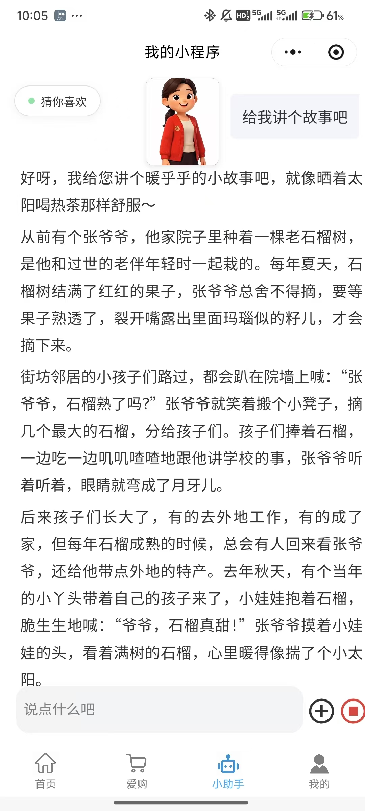

荧欢无忧养老 - 智慧居家养老服务平台

💡 项目简介
一款针对中国老龄化现状，由长春荧欢科技有限公司推出的智慧居家养老解决方案。项目基于微信原生框架与云开发技术，通过“社区辐射型”服务模式，旨在打通养老服务的最后一百米，为老年用户提供医疗提醒、心理关怀、生活互助及 AI 辅助等全方位支持。

👨‍💻 核心贡献
作为项目核心开发者，完成了从 0 到 1 的产品规划与核心功能实现：

1. 核心业务架构与首页研发 
（1）首页构建：独立完成小程序首页的 UI 设计与逻辑开发，集成社区活动报名、志愿者预约、家政服务等 8+ 个核心功能入口。
（2）SOS应急系统：设计并实现了基于用户资料状态的动态分级拨号逻辑，优先联系子女，缺失资料时自动跳转 110 紧急呼叫，确保生命通道畅通。
（3）结构化用药提醒引擎：突破传统闹钟限制，利用微信订阅消息实现包含“药品名、剂量、用法”的深度信息推送，显著提升老人服药依从性。

2. AI Agent 产品设计与构建 
（1）混合模型驱动：辅助接入字节跳动 (ByteDance) 与 DeepSeek 混合驱动的大模型，通过RAG (检索增强生成) 技术构建了专属养老知识库。
（2）助老交互优化：针对老年用户进行提示词工程 (Prompt Engineering) 调优，使 AI 助手能以通俗易懂的方式教授小程序操作及科普养生知识，有效降低科技鸿沟。

3. 用户体系与后台逻辑
实现了“我的”页面的完整业务逻辑，涵盖工具箱、会员充值、资料安全加密存储等模块。

📱 界面预览
(./image/首页2.jpg) |  | 
🌟 核心功能地图
社区活动系统：支持社区管理员发布动态，老人一键报名，解决信息不对称问题。
心理关怀模块：内置优质心理健康课程，并提供专业资质认证的心理咨询师预约接口。
爱购商城生态：无缝跳转外部成熟电商小程序，提供专为老人筛选的适老化产品。
健康备忘录：支持老人记录日常身体指标，作为就医时的辅助参考资料。
今日养生/学习：每日推送优质饮食健康与休闲娱乐视频，丰富精神生活。

📝 现状与版权说明
当前进度：项目已完成 0 到 1 的开发工作，正在进行上线流程及相关赛事评审。
授权说明：目前该项目仅作为个人/团队成果展示。为了保护比赛版权，项目预计于一年后开源。

---
联系我们：长春荧欢科技有限公司  
项目格言：“让科技有温度，让养老无忧虑。”
